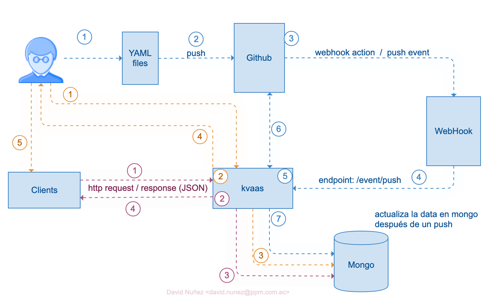
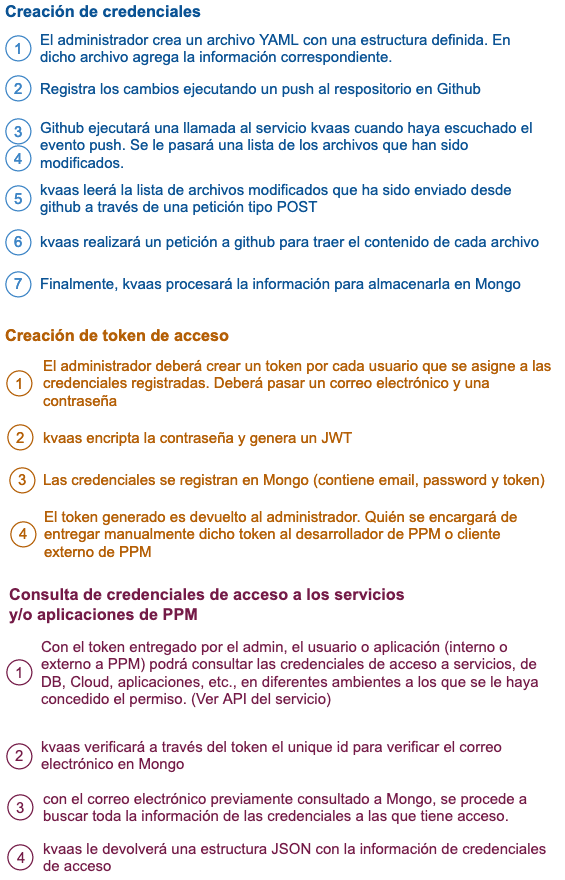
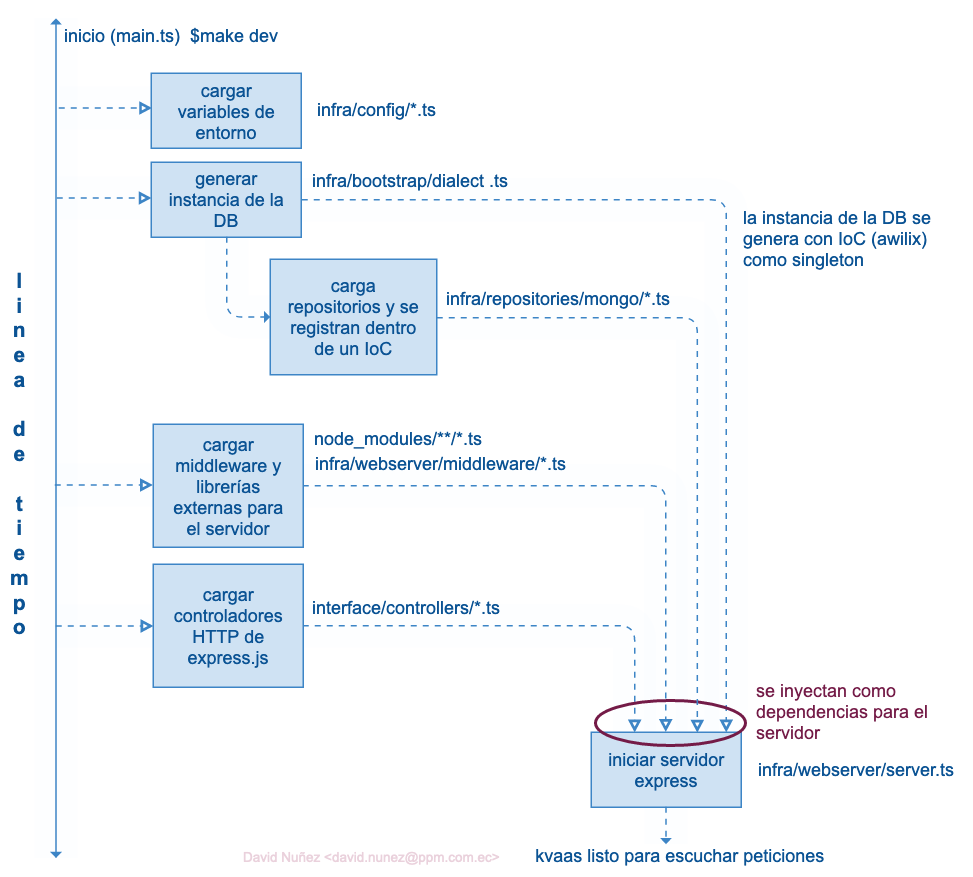
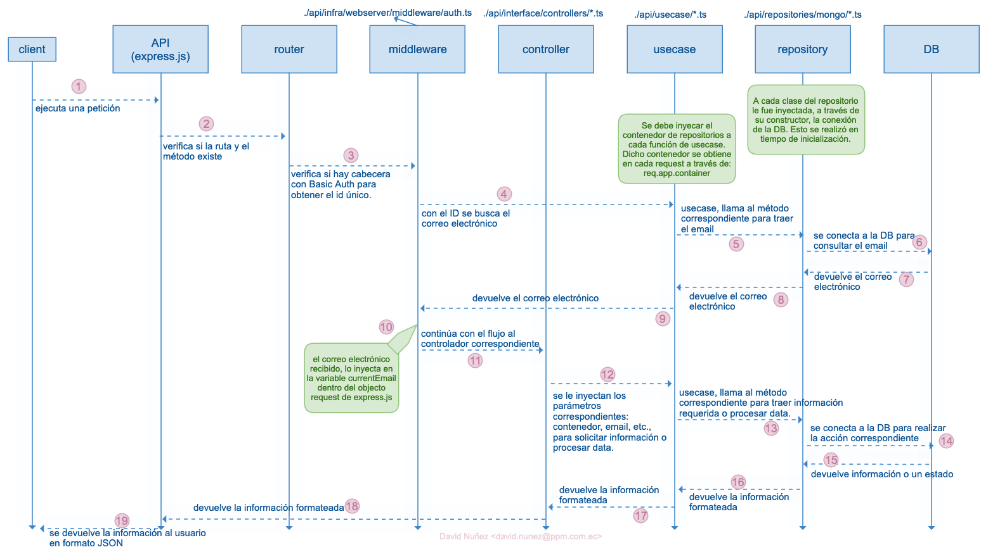
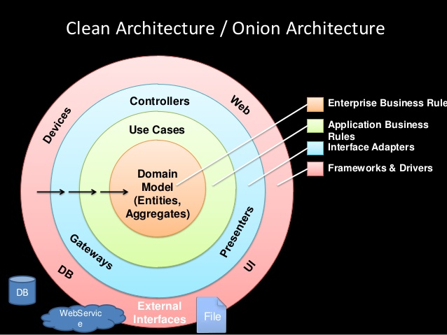

# kvaas - Key Vault as a Service
kvaas es una api que tiene la capacidad de almacenar credenciales de acceso y luego poder acceder a ellas a través de una API publica con un token de acceso.

> Está escrito completamente con Node.js y Typescript :)

# Empezar a desarrollar

## Requerimientos
- Node.js > 12
- Docker
- Bash
- Make

## Pasos
1. Crear un archivo `.env` en la ruta principal del proyecto.
2. Agregar datos en las variables de conexión de la base de datos. (estás variables serán utilizadas cuando se levante el contenedor Docker de Mongo)
3. Levantar el contenedor de mongo ejecutando desde la consola: `$ make mongo-run`
4. Acceder a Mongo a través de cualquier cliente, con las credenciales especificadas en la variable de entorno.
5. Crear la base de datos en Mongo
6. Crear un usuario para la base de datos creada
7. Crear un token de acceso en el proyecto donde se gestionarán las claves en Github. (no es este repositorio)
8. Copiar el token obtenido de Github en el archivo `.env``
9. Llenar los otros parámetros requieridos en el .env
10. Realizar la migración ejecutando desde la consola: `$ make mongo-migrate`
> Nota: La migración solo es para crear la colección users y agregar el usuario de administración. El resto de colecciones se irán creando de forma dinámica, cuando se agreguen datos al repositorio de claves.
10. Para empezar a desarrollar, ejecute desde la consola: '$make dev` o `npm run dev`

## ¿Cómo agrego un nuevo endpoint?

1. Declara el nuevo controller dentro de `./api/interface/controllers`.
Ejemplo:
```typescript

import {Request, Response} from 'express'
import { IController } from '@kvaas:TypesDefinitions';

export const NewController: IController = {
  endpoint: '',
  method: '',
  handler: async (req: Request, res: Response) => {
    res.send("ok")
  }
}
```
2. El controller creado anteriormente, se debe cargar en el servidor. Para ello, modifica el archivo `./api/main.ts`
```typescript
import { NewController } from './interface/controllers/NewController';

const controllers: IController[] = [
  ...,
  ...,
  ...,
  NewController
]

```

## ¿Cómo agrego una lógica de negocio?

### 1. crear la firma
La implementación se debe escribir en un nuevo archivo con extensión `.ts` y que deberá ser almacenado dentro de la ruta `./api/domain` .
Este archivo únicamente contiene los métodos que deberán ser implementados por el repositorio actual para ser utilizado en los casos de uso. 

Ejemplo:
```typescript
export class NewRepositoryDomain {
  methodToBeImplemented(param:string) {
    throw new Error('ERR_METHOD_NOT_IMPLEMENTED');
  }
}
```

> Esta firma permite que nuevas implementaciones puedan ser desarrolladas con facilidad. Esto quiere decir que, si en algún momento se migra de Mongo a MySQL, deberán respetar la firma anteriormente establecida. Cool verdad?

### 2. crear la lógica de negocio para la implementación actual (para mongo)
Aquí se debe crear la clase con los métodos de la firma establecida anteriormente que permitirá manipular la información con la base de datos que actualmente se esté utilizando. Crea la clase en la ruta `./api/infra/repositories/mongo`.
> Es importante mencionar que los controladores no deben acceder a esta clase directamente. La capa intermedia de acceso son los casos de uso. Con esto, el controlador no se ata a una implementación como tal (para Mongo por ejemplo).

Mongo es el soporte actual, por lo tanto, el código de consultas que se implemente en esta clase, es especificamente para Mongo. Si en algún momento se decide migrar de Mongo a MySQL, entonces habrá un repositorio para MySQL con una carpeta llamada mysql y dentro de esta, estarán las clases correspondientes.

```typescript
import { Db } from 'mongodb'
import { NewRepositoryDomain } from '../../../domain/NewRepositoryDomain';

export class NewRepository implements NewRepositoryDomain {
  private db:Db
  constructor(db: Db) {
    this.db = db
  }

  async methodToBeImplemented(param:string) {
    //aquí va la lógica de consultas y persistencia de datos
  }
}
```


**_¿Por qué? una clase en lugar de una función?_**
Bueno, en el proceso de inicialización, cada repositorio es inyectado a través de su constructor, la conexión de la base de datos. Puedes ver el gráfico de [ciclo de vida de inicialización de la aplicación](#ciclo-de-vida-de-inicializacion)

3. Registrar tu repositorio en el contenedor de repositorios. Para ello, deberás modificar el archivo ubicado en `./api/infra/bootstrap/dialect.ts`

```typescript

export default async () => {
  ...
  ...
  ...

  //support for MongoDB

  if (environment.database.dialect === constants.SUPPORTED_STORAGE.MONGO.NAME) {

      ...
      ...
      const { NewRepository } = await import('../../infra/repositories/mongo/NewRepository');
      ...
      ...

      container.register({
        db: asValue(db),
        ...,
        ...,
        ...,
        newRepository: asClass(NewRepository)
      });

  }

  ...
  ...
  ...
  return await container
}
```

Con los pasos anteriormente realizados, ahora dispondrás del repositorio en cada petición.


### 3. crear el caso de uso
El caso de uso es una capa intermedia que permite abstraer al controlador que motor de base de datos se está utilizando. Incluso, para la capa usecase, es desconocido cual es la implementación actual porque solo conoce de las firmas del contrato (los métodos disponibles). El contenedor de registro si conoce que motor de base de datos se está utilizando por debajo, pero solo provee acceso a los métodos a través de la firma del contrato.

Con la breve introducción del caso de uso, procedemos a crear el caso de uso para NewRepository. Creamos un archivo con extensión `.ts` dentro de la ruta `./api/usecase`

```typescript

import { AwilixContainer } from "awilix";
import { UserRepositoryDomain } from "../domain/NewRepository";

export const FindSomething = async (container: AwilixContainer, params:any) => {

  //container.resolve('newRepository') es otra alternativa para obtener el repositorio. Sin embargo, no provee intellysense.
  //por lo tanto, el editor de código no te mostrará automaticamente la lista de métodos implementados.
  //Por ese motivo, es mejor mapear a la estructura correspondiente como se muestra a continuación.
  const repository = container.resolve<UserRepositoryDomain>('newRepository')
  const outcome = repository.methodToBeImplemented(param)
  return outcome
}
```
Como se puede observar en el código anterior, este caso de uso no conoce en lo absoluto la implementación de la clase `NewRepository` creada para mongo. Pero si utiliza la firma del contrato que se ha especificado en `domain`.

Si algún rato, MySQL se quiere utilizar en lugar de mongo, el controlador y el caso de uso no se les modificará para nada.


## ¿Cómo accedo a un repositorio desde un controlador o middleware de express?

El contenedor que contiene(valga la redundancia) los repositorios, se inyecta como un parámetro más dentro del objecto `app` de `express.js`. Esto pasa en el ciclo de inicialización de la aplicación. Ver el gráfico de dicho ciclo más adelante.

### Acceder al contenedor de repositorios en un controlador
Utilizando el ejemplo anterior

```typescript

import {Request, Response} from 'express'
import { IController } from '@kvaas:TypesDefinitions';

export const NewController: IController = {
  endpoint: 'RUTA DE ACCESO',
  method: 'get|post|put|delete',
  handler: async (req: Request, res: Response) => {
    
    //obteniendo el contenedor de repositorios
    const container = req.app.container

  }
}
```

### Acceder alcontenedor de repositorios en un middleware

Puedes ver un ejemplo real en el middleware de authorización ubicado en `./api(infra/webserver/middleware/auth.ts`.

Pero en resumen, un middleware en express.js tiene una estructura similar a la de un controlador, con la diferencia de que tiene un tercer parámetro: este es `next`. Entonces para acceder al contenedor de repositorios, se lo hace de la misma manera que como se lo hizo anteriormente:

```typescript

import { Request, Response, NextFunction } from 'express';

export const middleware = (req: Request, res: Response, next: NextFunc) => {

  //obteniendo el contenedor de repositorios.
  const container = req.app.container

  //llamar al caso de uso pasándole el container
}
```

> Recuerda que este contenedor deberás pasar a los casos de usos para que puedan utilizar los métodos correspondientes de la implementación actual.


## Controller + Usecase + Repository en Acción!

Ahora veamos un ejemplo integrando todos los juguetes.


`controller ubicado en ./api/interface/controllers/NewController.ts`
```typescript

//controller

import {Request, Response} from 'express'
import { IController } from '@kvaas:TypesDefinitions';
import { FindSomething } from '../../usecase/CloudService'; 

export const NewController: IController = {
  endpoint: '',
  method: '',
  handler: async (req: Request, res: Response) => {
    const outcome = FindSomething(req.app.container, SOME_STRING_VALUE)
  }
}
```

Y tu caso de uso es (del ejemplo de caso de uso creado anteriormente):

`usecase ubicado en ./api/domain/controllers/NewController.ts`
```typescript

//usecase

import { AwilixContainer } from "awilix";
import { UserRepositoryDomain } from "../domain/NewRepository";

export const FindSomething = async (container: AwilixContainer, params:string) => {
  const repository = container.resolve<UserRepositoryDomain>('newRepository')
  const outcome = repository.methodToBeImplemented(param)
  return outcome
}
```


## Acera de los tipos y espacios de nombre

Como te habrás dado cuenta, en varias importaciones nos encontramos con 
```typescript
import { IController } from '@kvaas:TypesDefinitions';
```

Son las deficiones para el proyecto actual. Si necesitas agregar más deficiones, entonces deberás modificar el archivo `./api/types/kvaas/index.d.ts`

```typescript
declare module '@kvaas:TypesDefinitions' {
  import { Request, Response } from "express";
  export interface IDb {
    db: any
    close(): any;
    connect(): any;
  }
  export interface IController {
    endpoint: string;
    method: string;
    handler: (req: Request, res: Response) => {};
  }
  export interface StatusOperation {
    status: string;
    code: number;
    data: any;
  }
  export interface HttpValidationRequest {
    status: string;
    code: number;
    message: string
  }
}
```

Si no quieres utilizar el archivo anterior y crear tu propio espacio de nomnbres: entonces deberás declarar tu definición con extensión `.d.ts`
y cargarlo en el archivo `./api/main.ts` en la parte superior.
```typescript
/// <reference path="./types/kvaas/newDefinition.d.ts"/>
```
## API

### Crear usuarios

#### Petición
authentication: `Bearer Token`
endpoint: `/api/v1/users`
method:   `POST`
body: `(JSON)`

| Key  |Type    | Limit | Required | Observations  |
|------|--------|-------|--------- | --------------|
| email | string | 255    | si       | - |
| password | string | 255 | si | - |

Por ejemplo:
```json
{
  "email": EMAIL,
  "password": PASSWORD
}
```
#### Respuesta

body: `(JSON)`

| Key  |Type    | Value | Observations  |
|------|--------|-------| --------------|
| status | string |   -   |      -     |
| status | code  |    - |      -     |
| status | message | token generado   |      El token generado, deberá ser entregado al desarrollador o cliente externo.     |

Por ejemplo:
```json
{
    "status": STATUS,
    "code": HTTP_STATUS_CODE,
    "message": TOKEN_GENERATED
}
```

 #### _Ver en acción a través de curl_

```bash

curl \
--request POST 'localhost:3000/api/v1/users' \
--header 'Authorization: Bearer {TOKEN_GENERATE_IN_MIGRATION_PROCESS}' \
--header 'Content-Type: project/json' \
--data-raw '{
    "email": "david.nunez@ppm.com.ec",
    "password": "1234567890"
}'
```
### Verificar estado de la aplicación

En la mayoría de servicios cloud, se requiere un endpoint para verificar el estado de la aplicación. Este parámetro es configurable a través de la variable de entorno `HEALTH_ENDPOINT`

#### Petición
authentication: `Sin autenticación`
endpoint: `HEALTH_ENDPOINT`
method:   `GET`
body: `ninguno`


#### Respuesta

body: `string`

| Key  |Type    | Value | Observations  |
|------|--------|-------| --------------|
| status | string |   "ok"  |      -     |

Por ejemplo:
```
ok
```

#### _Ver en acción a través de curl_
```bash
curl --silent --location --request GET 'localhost:3000/health'
```

### Obtener el id de los servicios de la nube que han sido registrados

#### Petición

authentication: `Bearer Token`
endpoint: `/api/v1/services`
method:   `GET`
body: `ninguno`

#### Respuesta

body: `json`

| Key  |Type    | Value | Observations  |
|------|--------|-------| --------------|
| cloudServices | array [string] | id de los servicios cloud | - |

Por ejemplo:
```json
{
    "cloudServices": [
        "_aws",
        "_gcp"
    ]
}
```
**_¿Por qué el prefijo?_** Porque cada servicio registrado en los archivos YAML, se crea una colección, y claro, más colecciones pueden crearse dentro de Mongo, entonces este prefijo se agrega automáticamente cuando se crea la colección con el propósito de idenfiticar que es una colección de un servicio cloud.

#### _Ver en acción a través de curl_

```bash
curl \
--request GET 'localhost:3000/api/v1/services' \
--header 'Authorization: Bearer {USER_TOKEN}'
```

### Obtener el id de los proyectos registradps

Los proyectos son por ejemplo: ClubMiles, Ecosistemas, etc.

#### Petición

authentication: `Bearer Token`
endpoint: `/api/v1/services/{SERVICE_ID}/projects`
method:   `GET`
body: `ninguno`

| Key  |Type    | Value | Observations  |
|------|--------|-------| --------------|
| SERVICE_ID | string | id del servicio cloud | - |

#### Respuesta

body: `json`

| Key  |Type    | Value | Observations  |
|------|--------|-------| --------------|
| projects | array [string] | id de los proyectos que están en el servicio cloud con id SERVICE_ID | - |

Por ejemplo:
```json
{
    "projects": [
        {
            "_id": "pichinchamiles"
        },
        {
            "_id": "clubmiles"
        }
    ]
}
```

#### _Ver en acción a través de curl_

```bash
curl \
--request GET 'localhost:3000/api/v1/services/{SERVICE_ID}/projects' \
--header 'Authorization: Bearer {USER_TOKEN}'
```

### Obtener el id de los ambientes

Una aplicación puede tener credenciales de acceso para diferentes ambientes. Este endpoint devolverá en que ambientes el usuario tendrá acceso para una aplicación en particular.

#### Petición

authentication: `Bearer Token`
endpoint: `/api/v1/services/{CLOUD_ID}/projects/{PROJECT_ID}/environments`
method:   `GET`
body: `ninguno`

| Key  |Type    | Value | Observations  |
|------|--------|-------| --------------|
| CLOUD_ID | string | id del servicio cloud | - |
| PROJECT_ID | string | id de la aplicación  | - |

#### Respuesta

body: `json`

| Key  |Type    | Value | Observations  |
|------|--------|-------| --------------|
| environments | array [string] | id de los environments asociados a un projecto que está registrada en un servicio cloud | - |

Por ejemplo:
```json
{
    "environments": [
        {
            "_id": "production"
        },
        {
            "_id": "staging"
        }
    ]
}
```

#### _Ver en acción a través de curl_

```bash
curl \
--request GET 'localhost:3000/api/v1/services/{CLOUD_ID}/projects/{SERVICE_ID}/environments' \
--header 'Authorization: Bearer {USER_TOKEN}'
```

### Obtener credenciales de acceso

El administrador puede crear datos de acceso a aplicaciones web, servicios web, etc., ya sea para un grupo de usuarios o para un único usuario.
Este endpoint permitirá obtener las credenciales de acceso a las que un usuario está asociado a una aplicación dentro de un proyecto como tal.

Por ejemplo. Clubmiles es el proyecto, y las aplicaciones asociadas son: Aplicación web, Base de datos, etc.


#### Petición

authentication: `Bearer Token`
endpoint: `/api/v1/services/{CLOUD_ID}/projects/{PROJECT_ID}/environments/{ENVIRONMENT_ID}`
method:   `GET`
body: `ninguno`

**_parametros en la url_**
| Key  |Type    | Value | Observations  |
|------|--------|-------| --------------|
| CLOUD_ID | string | id del servicio cloud | - |
| PROJECT_ID | string | id de la aplicación  | - |
| ENVIRONMENT_ID | string | id del ambiente  | - |

**_query string_**
| Key  |Type    | Value | Observations  |
|------|--------|-------| --------------|
| kind | string | nombre de la aplicación | - |

#### Respuesta

ejemplo 1: sin usar query string

body: `json`

| Key  |Type    | Value | Observations  |
|------|--------|-------| --------------|
| status | string | "ok|failed" | - |
| code | int | HTTP_STATUS_CODE | - |
| credentials | array[JSON] | lista JSON con todos los servicios a los que está asociado el usuario| - |

Por ejemplo:
```json
{
  "status": "ok",
  "code": 200,
  "credentials": [
    {
      "projectName": NOMBRE DEL PROYECTO,
      "environment": {ENVIRONMENT_ID},
      "kind": TIPO_DE_APLICACION,
      "description": DESCRIPCIÓN DE LA APLICACIÓN,
      "key": NOMBRE_DE_USUARIO|CORREO_ELECTRONICO|OTROS,
      "value": CONTRASEÑA|TOKEN|IDENTIFICADOR_UNICO,
      "endpoint": IP_PARA_CONECTARSE_AL_SERVICIO
    },
    {
      "projectName": NOMBRE DE LA APLICACION_B,
      "environment": {ENVIRONMENT_ID},
      "kind": TIPO_DE_APL,
      "description": DESCRIPCIÓN DE LA APLICACIÓN,
      "key": NOMBRE_DE_USUARIO|CORREO_ELECTRONICO|OTROS,
      "value": CONTRASEÑA|TOKEN|IDENTIFICADOR_UNICO,
      "endpoint": IP_PARA_CONECTARSE_AL_SERVICIO
    },

  ]
}
```

#### _Ver en acción a través de curl_

```bash
curl \
--request GET 'localhost:3000/api/v1/services/{CLOUD_ID}/projects/{SERVICE_ID}/environments' \
--header 'Authorization: Bearer {USER_TOKEN}'
```

# Desplegar el proyecto en la nube

Actualmente no existen pipelines creados para realizar un flujo CI/CD automatizado. Esta consideración y tarea la debe tomar el equipo de DevOps.

Sin embargo, para propósitos de pruebas en Cloud, hay algunos comandos que permiten realizar manualmente el despliegue de la aplicación en Google Cloud Run. Para ello, deberás configurar tu entorno con la cuenta y el proyecto de Google Correspondiente.

Los comandos para llevar a cabo el despliegue manual son:
```
$ make docker-build
$ make docker-publish
$ make deploy-on-gcr

```
Esta secuencia de comandos puedes utilizarlo en un pipeline en GithubAction, Bibucket Pipeline, CircleCI, pero ya queda a consideración del equipo de DevOps llevar a cabo esta tarea de automatizar el flujo de CI/CD.
¿Deseas crear un flujo CI/CD con la secuencia de comandos anterior? Mira [este ejemplo](https://github.com/davidenq/go-cicd) para más información

# Lista de comandos
La implementación actual tiene un archivo Makefile como punto centralizado para llevar a cabo cualquier acción: construir el proyecto, ejecutar el servidor, construir la imagen docker, desplegar en la nube, entre otros. A continuación, se muestra una lista de cada uno de los comandos que puedes utilizar.

## comandos para operaciones con la aplicación web
`$ make dev`: Permite levantar la aplicación web para empezar a desarrollar. Por debajo es un simple `$ npm run dev`.
`$ make build`: Permite construir la aplicación (compila de Typescript a Javascript) para la puesta en producción. Por debajo es un simple `$ npm run build`
- `$make clean`: Remueve los bundles construidos para la aplicación. Por debajo es un simple `$ npm run clean`

## comandos para operaciones con Docker
- `$ make docker-build`: Construirá la imagen Docker con la aplicación. Por debajo es una llamada al script `./scripts/docker/build.sh`
- `$ make docker-run`: Ejecuta el contenedor Docker con la aplicación. Por debajo es una llamada al script `./scripts/docker/run.sh`
- `$ make docker-publish`: Publica el contenedor docker en un repositorio de contenedores. Para ello deberás estár conectado a dicho contenedor. Por debajo es una llamada al script `./scripts/docker/publish.sh`

## comandos para desplegar la aplicación en Cloud
Actualmente solo existe un `script` para subir la aplicación en Google Cloud Run.
- `$ make deploy-on-gcr`: Desplegará la aplicación en Google Cloud Run. Por debajo es una llamada al script `./deploy/google/gcr.sh`. Este comando previamente construye la imagen y la publica en el registro de contenedores correspondiente.

## comandos para operaciones con Mongo
`$ make mongo-run`: Levantará un contenedor con Mongo. Creará un volumen al mismo nivel de la aplicación para persistir la data. 
`$ make mongo-stop`: Apagará el contenedor y lo destruirá.
`$ make mongo-migrate`: Permitirá crear la colección user y el usuario administrador correspondiente.


# Conceptos

## ¿Cómo trabaja kvaas?

A continuación, se muestra un esquema de tres escenerios: creación y almacenamiento de claves, creación de usuarios y token de accesos y, consulta de claves.




## Ciclo de vida de inicialización



## Ciclo de vida de peticiones



## Arquitectura de kvaas
Aunque kvaas no es un sistema complejo como tal, tiene sus bases en una arquitectura limpia. El propósito es separar de mejor manera responsabilidades, extender funcionalidades a través de contratos sin cambiar el core, entre otros beneficios.



## Estructura de carpetas

```
├── api/
│   ├── domain /
│   ├── infra /
│   │   ├── boostrap /
│   │   ├── config /
│   │   ├── migrations /
│   │   ├── repositories /
│   │   │   ├── mongo /
│   │   ├── storage /
│   │   ├── webserver /
│   │   │   ├── middleware /
│   ├── interface /
│   ├── types /
│   │   ├── express /
│   │   ├── kvaas /
│   ├── usecase /
│   ├── utils /
│   │   ├── main.ts
├── build /
├── deploy /
├── docker-volumen /
├── docs /
├── iaac /
├── node_modules /
├── scripts /
├── tests /
├── .env
├── .env.example
├── .gitignore
├── CONTRIBUTING.md
├── Makefile
├── nodemon.json
├── package-lock.json
├── package.json
├── README.MD
├── tsconfig.json
```

- `api`: Api contiene toda la lógica de kvaas.
  - `domain`: Contiene los contratos para procesar la información.
  - `infra`: Contiene todo lo que corresponde a la parte de infraestructura y externo al modelo de negocio de la aplicación.
    - `bootstrap`: Aquí se carga el motor de base de datos que es especificado a través de variables de entorno. Actualmente solo está soportado para Mongo. Sin embargo, hay una guía que permite extender el soporte para MySQL. Aquí se utiliza singleton para la instancia de la base de datos e inyección de dependencias para los repositories.
    - `config`: Contiene toda la información de constantes y variables de entorno que se cargan en el instante de iniciar la apliación.
    - `migrations`: Contiene los scripts para migraciones. Actualmente solo existe para la creación de la colecció de users en Mongo. Las demás colecciones son creadas automáticamente cuando se trae la información de Github.
    - `repositories`: Contiene todas las interfaces de peticiones a la base de datos correspondiente implementada. Actualmente solo hay los repositorios que permiten conectarse a la base de datos de Mongo y leer, escribir, actualizar la información en Mongo.
    - `storage`: Contiene la conexión a la base de datos que se requiere. Actualmente solo tiene la implementación para Mongo.
    - `types`: Dado que se está trabajando con Typescript, en esta carpeta se agregan las interfaces que permiten extender el core de Express y definir contratos para kvaas.
    - `usecase`: Aquí se implementan los métodos que permiten devolver o almacenar la información en el motor de Base de datos que se haya implementado. Aquí no hay ningúna lógica de consultas, solo métodos de las firmas requeridas.
    - `utils`: pequeñas librerías utilizadas por el framework para realizar operaciones adicionales no disponibles en el framework como tal.
    - `main.ts`: el punto de entrada de la aplicación.
- `build`: Sirve para almacenar todos los elementos que serán construidos. Ya sean bundles de la aplicación así como archivos como Dockerfile para construir los contenedores.
- `deploy`: Contiene scripts o archivos de configuración que permitirán desplegar la aplicación en cualquier servicio en la nube. Actualmente, existen un script para desplegar la aplicación en `Google Cloud Run``
- `docker-volume`: Es una carpeta que se generará cuando se levante el contenedor de Mongo. Permite persistir la información incluso después de que el contenedor sea borrado o apagado. Esta carpeta no tiene seguimiento git.
- `docs`: En esta carpeta se almacena todo tipo de archivos e información que permita tener mayor información del proyecto.
- `iaac`: (Infraestructure as a Code) En esta carpeta se debe colocar archivos que permitan crear infraestructura para el proyecto actual. Por ejemplo, archivos de terraform, asinble, entre otros.
- `node_modules`: archivo que contiene las dependencias de la API. Nada que hacer aquí.
- `scripts`: Contiene una serie de scripts que permiten gestionar los build, los deploys, iaacs, etc. Actualmente hay scripts para levantar, construi, publicar y ejecutar el contenedor Docker de la aplicación.
- `tests`: Carpeta para pruebas unitarias, pruebas de integración y/o pruebas end to end. Actualmente no existen pruebas.


# Contribuir

Se ha preparado una documentación separada donde encontrará lineamientos para poder contribuir al proyecto. Por favor, lea el documento [CONTRIBUTING](./CONTRIBUTING.md) para conocer más acerca de dichos lineamientos. Es importante mencionar que los lineamientos están enfocados en buenas prácticas, como gestionar el flujo de trabajo de GIT, cómo manejar el versionamiento, cómo realizar commits, entre otros.

[](https://lerna.js.org/)
